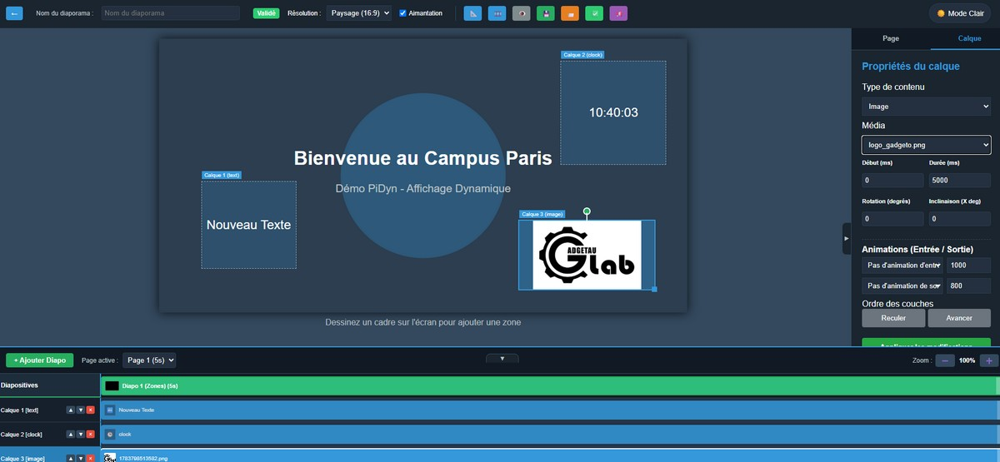
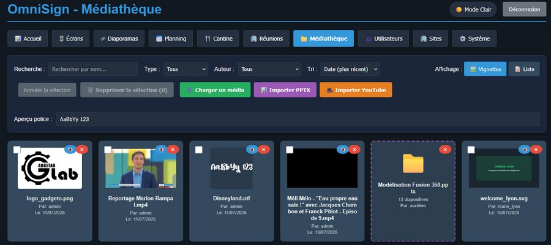

# OmniSign - Dynamic Digital Signage System

<p align="center">
  
</p>

---

## 🌍 Table of Contents / Sommaire

<details open>
<summary><b>🇬🇧 English Documentation</b> (Click to collapse/expand)</summary>

*   [Overview](#english)
*   [🗺️ System Architecture (Diagram)](archi.md)
*   [Technical Architecture Details](architecture_omnisign.md)
*   [Features](#features)
*   [Technologies Used](#technologies-used)
*   [Getting Started](#getting-started)
    *   [Step 0: Getting the Source Code](#0-getting-the-source-code)
    *   [Step 1: Server Installation](#1-server-installation--configuration)
    *   [Step 2: Client Player Installation](#2-client-player-installation)
    *   [Step 3: Troubleshooting & Diagnostics](#3-troubleshooting--diagnostics)
*   [Usage](#usage)
*   [License](#license)
</details>

<details open>
<summary><b>🇫🇷 Documentation en Français</b> (Click to collapse/expand)</summary>

*   [Présentation](#français)
*   [🗺️ Schéma d'Architecture Système](archi.md)
*   [Détails Techniques de l'Architecture](architecture_omnisign.md)
*   [Fonctionnalités](#fonctionnalités)
*   [Technologies Utilisées](#technologies-utilisées)
*   [Guide d'Installation](#guide-dinstallation)
    *   [Étape 0 : Récupérer les Sources](#0-récupérer-les-sources)
    *   [Étape 1 : Installation & Configuration du Serveur](#1-installation--configuration-du-serveur)
    *   [Étape 2 : Installation des Écrans (Clients)](#2-installation-des-écrans-clients)
    *   [Étape 3 : Résolution des Problèmes & Diagnostics](#3-résolution-des-problèmes--diagnostics)
*   [Utilisation](#utilisation)
*   [Licence](#licence)
</details>

---

## English

> [!WARNING]
> This project has just been launched and is currently a **Proof of Concept (POC)**. It is **not** intended for production use at this stage.

### Preview
<p align="center">
  <br>
  <em>Secure Login Interface</em><br><br>
  <br>
  <em>Multi-zone Slideshow Editor</em><br><br>
  <br>
  <em>Centralized Media Library Management</em>
</p>

OmniSign is a comprehensive digital signage solution designed to provide centralized management of content for Raspberry Pi-based display units. It consists of a Node.js server for administration and content delivery, and a client-side application for Raspberry Pi devices that handles display and real-time synchronization.

## Features
### Server-side (Node.js)
*   **Web-based Administration Panel:** A user-friendly interface (`admin.html`, `editor.html`, `users.html`, `diaporamas.html`, `media.html`, `sites.html`) for managing all aspects of the digital signage system.
*   **Multi-Site Isolation (Multi-Tenancy):** Group players, playlists, groups, media, and users within isolated "Sites" for clean multi-tenant management. Non-admin users are restricted to their assigned site.
*   **Role-Based Access Enforcement:** Authors are only allowed to modify or delete their own playlists and media files, preventing unauthorized modifications on other files.
*   **Enriched Statistics Dashboard:** A premium visual grid showing online/offline status, playlists/sequences/media counts, and the current active site name, with isolated analytics graphs per site.
*   **Asynchronous YouTube & PPTX Imports:** Non-blocking processing of files. Slides and YouTube downloads run in the background while real-time progress bars (using XMLHttpRequest and WebSockets) keep the user updated.
*   **YouTube Bypass (Cookies):** Bypass YouTube's aggressive bot detection (HTTP 429) by uploading a standard Netscape browser `cookies.txt` file directly in the system settings panel.
*   **Real-time Flash Messaging:** Send instant alerts (info, warning, danger) to specific screens or all devices simultaneously.
*   **Advanced Operations Analytics:** Multi-chart dashboard (Chart.js) displaying hourly playback activity (last 24h), cumulative display time per day (last 7 days), screen activity distribution (pie chart), and media type breakdown (images vs. videos vs. templates doughnut chart) with a "Top 50" statistics leaderboard.
*   **Interactive Vignettes Grid:** Beautiful card-based visual layout for screen management showing active device configurations, online/offline colors, and real-time screen captures inside virtual monitor mockup cards.
*   **Remote Device & Power Control:** Take screenshots, adjust volume (system & browser media), force synchronization, clear local cache, send power commands (💡 Wake up, 🌙 Sleep/Standby), restart the system service, or trigger system reboots directly from the admin dashboard.
*   **Weekly Sleep & Power Scheduling:** Manage screen power consumption automatically with a granular weekly scheduler. Define up to two active display time slots per day (e.g., morning and afternoon windows) with independent weekend toggles, reducing energy costs automatically.
*   **Periodic Screen Capturing:** Turn on automatic periodic screenshots in the system settings page with custom interval rules to keep vignettes updated automatically.
*   **Group Management:** Organize players by location or category to assign content or trigger actions at scale.
*   **User Management & Granular Roles:** Create and manage users with specialized roles (`admin`, `editor`, `author`, `cook`, `secretary`) for tailored access control. Passwords are securely hashed using bcrypt.
*   **Multi-Site & Multi-Week Canteen Management (`/canteen`):** Dedicated **Cook (`cook`)** workspace for managing weekly lunch menus per campus/site. Supports multi-week navigation, ISO week pickers, date range indicators, completion badges, and live player API integration (`/api/player/canteen/current`).
*   **Meeting Rooms & Visitor Guidance Agenda (`/meetings`):** Dedicated **Secretary (`secretary`)** workspace featuring an interactive visual hourly calendar grid (08:00–19:00), meeting room management (location, capacity, custom colors), chronological visitor guidance lists, full-screen orientation kiosk mode, and live display integration (`/api/player/meetings/today`).
*   **Template Style Customizer (`/templates`):** Interactive visualization dashboard for editing Canteen and Meeting layers styles. Customize background configurations, and edit the HTML structure directly using a rich WYSIWYG visual editor featuring advanced inline text sizing (bypassing browser minimum font size limits via a virtual 1920x1080 canvas scaled with CSS), inline color pickers, custom library fonts, and a categorized emoji selector, with changes updated live inside a high-fidelity 16:9 preview canvas.
*   **Slideshow Sequences Management (`/diaporamas`):** Combine multiple slideshows (playlists) in a looping sequence. Change play orders using simple vertical ordering controls and plan them directly within the planning dashboard.
*   **Playlist Management:** Create, edit, and delete dynamic playlists composed of various media types. Includes an advanced management panel with filters (search by name/author, filter by validation status, resolution, and live usage detection to show which playlists are active on screens or sequences vs orphaned).
*   **Integrated Native SVG Animator (Sozi):** Interactive visual creator (`sozi_editor.html`) allowing step-by-step definition of zoom, pan, and rotation frames directly inside OmniSign on plain SVG files. Animations are rendered natively with hardware-accelerated CSS 3D transitions.
*   **Three Distinct Layer Types:** Content isolation into `sozi` (native vector animations), `sozi_zip` (legacy extracted ZIP presentations played in an iframe), and `web` (regular web pages or custom URLs) with smart filter parameters and automatic duration synchronization matching the animation length.
*   **Media Management:** Upload and organize media files (images, videos, custom fonts) with grid/list view toggles, custom search filter, and sorting.
*   **Player Management:** Register, approve, and assign specific playlists to individual Raspberry Pi display units. Monitor their status (last seen).
*   **Content Scheduling:** Implement time-based scheduling to automatically switch playlists on players at predefined times.
*   **Real-time Updates:** Utilizes Socket.IO to push instant playlist changes and updates to connected Raspberry Pi clients.
*   **Maintenance & Backup:** Built-in ZIP backup and restoration tool with streaming file transfers to prevent Node.js memory leaks and RAM overflows. Supports complete backups (database + all media files) and lightweight backups (database only), as well as automated periodic backups (daily, weekly, monthly) with configurable file retention (rotation) on the server.
*   **Data Persistence:** Stores all configuration, user data, playlists, and schedules in a SQLite database (`pidyn.sqlite`).
*   **Authentication & Two-Factor (2FA):** API key-based client authentication, token-based panel authentication, and secure TOTP (Time-based One-Time Passwords) double authentication compatible with Google Authenticator, restricted strictly to the root `admin` account.
*   **System Audit Logs & Activities:** Centralized, isolated logs registry (logins, slide creations, publishes, system settings changes, user management) with a paginated UI browser, dynamic category filtering, and direct CSV exporting.
*   **Systemd Server Daemonization:** Automated configuration prompts inside the Linux server setup script to deploy the CMS as a persistent background daemon service (`omnisign-server.service`).
*   **System Logs:** Automated timestamps on all server and client logs for easier troubleshooting.
*   **Standalone Executable:** Capability to package the server as a single `.exe` (Windows) or binary (Linux) using `pkg` for easier distribution.
*   **PPTX Import:** Fully functional import of PowerPoint presentations converting slides into playlist images (requires `LibreOffice` and `pdftocairo` on the server).
*   **YouTube Media Import:** Direct YouTube video downloading and importing to the media library using `yt-dlp`.
*   **Interactive Slideshow Vignettes:** Grid/List view switcher. Grid view features animated thumbnails that cycle through the playlist slides, dynamically rendering the page background, scaled text layers (with custom fonts, alignment, colors), media images, media videos, clocks, and full templates (canteen, meeting status, weather, full-screen video with captions).
### Client-side (Raspberry Pi, Desktop Linux & Windows)
*   **Automated Setup:** Improved `bash` scripts (`setup_pi.sh` for Raspberry Pi Bookworm/Trixie, `setup_linux.sh` for general Linux desktop systems like Linux Mint / Ubuntu), handling automated installations of Node.js, Chromium, audio/capture tools, and graphical configuration.
*   **Robust Screenshot Fallbacks:** Advanced multi-tool fallback mechanism (`gnome-screenshot` + `scrot` + `grim`) with auto-resolution of active display GDM authority variables, preventing black screens for hardware-accelerated players on Linux Desktop (Zorin OS) and Raspberry Pi.
*   **Kiosk Mode:** Advanced Chromium configuration (auto-login, cursor hiding with `unclutter`, hardware acceleration) for a professional full-screen experience.
*   **Automatic Boot:** Automatic configuration of LightDM, Openbox or desktop session autostart launchers to start the player immediately upon login/power-up.
*   **Systemd / User Services:** Sets up `sync-engine.js` as a systemd background service (system-level or user-session level) for automatic operation.
*   **Real-time Playlist Synchronization:** The client player connects to the server via Socket.IO to receive playlist updates.
*   **Enhanced Monitoring:** Reports network status (IP, MAC), WiFi details (SSID, Signal Quality), system audio volume levels, and playback progress to the CMS.
*   **Media Synchronization:** Automatically downloads and caches media files locally from the server, ensuring smooth playback and offline capability.
*   **Configurable:** Reads device-specific configuration (`DEVICE_ID`, `SERVER_URL`, `API_KEY`) from `./setup.txt` (local directory) or `/boot/firmware/setup.txt`.

## Technologies Used
*   **Backend:** Node.js, Express.js, Socket.IO, fs-extra, multer, bcrypt, axios
*   **Frontend:** HTML, CSS, JavaScript (for admin UI)
*   **Client (Raspberry Pi):** Node.js, Socket.IO Client, axios, Chromium, X11, LightDM, Openbox, Systemd, Bash
*   **Database:** SQLite for robust data persistence

## Getting Started

### 0. Getting the Source Code
Clone the repository using Git:
```bash
git clone https://github.com/gotenash/OmniSign.git
cd OmniSign
```

### 1. Server Installation & Configuration

#### Prerequisites
- **Node.js**: v18.x or v20.x (LTS recommended)
- **Optional (for PowerPoint Import)**: LibreOffice and Poppler-Utils (provides `pdftocairo`).
- **Optional (for YouTube Import)**: `yt-dlp` and `ffmpeg` (the setup scripts will attempt to install these automatically).

#### A. Windows Server
Double-click the **`Installer_OmniSign.bat`** file at the root of the repository.
The interactive guided wizard will:
1. Detect or install/upgrade **Node.js** via `winget`.
2. Install all backend `npm` dependencies.
3. Create a shortcut **"OmniSign Serveur"** on your Desktop.
4. Auto-launch the server and open your default browser at `http://localhost:3000`.

*To start the server manually at any time, use the Desktop shortcut or double-click `Lancer_OmniSign.bat`.*

#### B. Linux Server (Ubuntu / Debian / Raspberry Pi OS)
Run the script **`setup_server.sh`** at the root of the repository:
```bash
chmod +x setup_server.sh
./setup_server.sh
```
The script will guide you to:
1. Update packages and install system dependencies (`nodejs`, `npm`, `ffmpeg`, `poppler-utils`, `libreoffice`, `yt-dlp`).
2. Install all Node.js libraries in the `server` directory.
3. Create a **Desktop shortcut** to launch the server.
4. Prompt you to register a **systemd service** (`omnisign-server.service`) to run the CMS as a background daemon automatically starting at boot.

*To start the server manually, run `./Lancer_OmniSign.sh`.*

#### C. Docker Deployment
If you prefer containerized deployment, run:
```bash
docker compose up -d --build
```
This builds a Node 20 container containing all system utilities (ffmpeg, yt-dlp, LibreOffice) and persists the media assets and the SQLite database inside a Docker volume named `omnisign-data`.

---

### 2. Client Player Installation

Before launching a client installer, ensure you have logged into the OmniSign admin panel, navigated to **Écrans (Screens)**, and copied your **Screen API Key**.

> [!TIP]
> **Using a Domain Name & Reverse Proxy (e.g., Nginx Proxy Manager)**:
> If you host OmniSign behind a reverse proxy using a domain name (e.g., `https://omnisign.yourdomain.com`), make sure to **enable WebSocket support** in your proxy configuration (e.g., toggle "Websockets Support" in Nginx Proxy Manager). This is required for real-time player commands and status sync.


#### A. Windows Client (`client_win/`)
1. Go to the `client_win/` folder and double-click **`Installer_Client_Windows.bat`**.
2. Enter the **Server URL** (e.g., `http://192.168.1.50:3000`).
3. Enter your **Screen API Key** and a unique **Device ID** (e.g., `lobby-screen-01`).
4. The script creates `setup.txt`, installs Node.js packages, and adds `omnisign-start.bat` to your Windows startup group (`shell:startup`) so it runs automatically in full screen when Windows starts.

#### B. Raspberry Pi Client (`client_pi/`)
*Compatible with Raspberry Pi OS Bookworm or newer (Desktop variant).*
1. Navigate to the client directory and run the installer:
   ```bash
   cd client_pi
   bash installer_pi.sh
   ```
2. The interactive script will ask for the Server URL, API Key, and Device ID, writing them to `/boot/firmware/setup.txt`.
3. It installs `nodejs`, `npm`, `chromium-browser`, and `unclutter` (to hide the mouse cursor).
4. It sets up an Openbox autostart script to boot the browser directly in kiosk full-screen mode on startup.
5. It registers the synchronization engine as a system daemon:
   - Check status: `sudo systemctl status omnisign-client.service`
   - Read logs: `journalctl -u omnisign-client.service -f`

#### C. Linux Desktop Client (`client_linux/`)
*Tested on Linux Mint, Ubuntu, and Zorin OS.*
1. Navigate to the client directory and run the installer:
   ```bash
   cd client_linux
   bash installer_linux.sh
   ```
2. Enter your setup details when prompted (saved to `setup.txt`).
3. The installer configures local browser autostart files in `~/.config/autostart/` to boot the player on graphical login.

---

### 3. Troubleshooting & Diagnostics

- **Black Screen / Captured Screenshots are Black**: On some Linux variants using hardware-accelerated drivers, screenshots may display black. The client handles automatic fallback between `gnome-screenshot`, `scrot`, and `grim` (Wayland). Make sure the player session is logged in graphically.
- **Sync Issues**:
  - Verify that the player can reach the server: `curl http://YOUR_SERVER_IP:3000/api/status`
  - Check the client process logs. For Pi / Linux, run `journalctl --user -u omnisign-sync -n 100` or check the local `logs/` folder inside the client directory.

## Usage
1.  **Access Admin Panel:** Open a web browser and navigate to `http://your-server-ip:3000`.
2.  **Login:** Use the default credentials (`admin`/`password`) to log in. **It is highly recommended to change default passwords immediately.**
3.  **Upload Media:** Go to the media section to upload your images and videos.
4.  **Create Playlists:** Design playlists by adding your uploaded media, setting durations, and other properties.
5.  **Manage Players:** Approve new Raspberry Pi clients that connect. Assign playlists to them manually or create schedules.
6.  **Schedule Content:** Define schedules to automatically display different playlists at specific times on your players.

## License
This project is licensed under the MIT License.

# OmniSign - Système d'Affichage Dynamique

<p align="center">
  
</p>
## Français

> [!WARNING]
> Ce projet vient d'être lancé et est actuellement un **Proof of Concept (POC)**. Il ne doit **pas** être utilisé en production pour le moment.

### Aperçu
<p align="center">
  <br>
  <em>Interface de connexion sécurisée</em><br><br>
  <br>
  <em>Éditeur de diaporamas multi-zones</em><br><br>
  <br>
  <em>Gestion centralisée de la médiathèque</em>
</p>

OmniSign est une solution complète d'affichage dynamique conçue pour offrir une gestion centralisée du contenu pour les unités d'affichage basées sur Raspberry Pi. Il se compose d'un serveur Node.js pour l'administration et la diffusion de contenu, et d'une application côté client pour les appareils Raspberry Pi qui gère l'affichage et la synchronisation en temps réel.

## Fonctionnalités
### Côté Serveur (Node.js)
*   **Panneau d'Administration Web :** Une interface conviviale (`admin.html`, `editor.html`, `users.html`, `diaporamas.html`, `media.html`, `sites.html`) pour gérer tous les aspects du système d'affichage dynamique.
*   **Cloisonnement Multi-Site :** Regroupez les utilisateurs et isolez les écrans/diaporamas/groupes/médias par "Site" pour une gestion multi-entités totalement étanche. Les utilisateurs non-administrateurs sont confinés à leur site d'affectation.
*   **Sécurisation des Droits Auteur :** Les auteurs ne peuvent modifier et supprimer que les diaporamas et médias dont ils sont propriétaires, éliminant tout risque de modification ou de suppression non autorisée.
*   **Tableau de Bord de Statistiques Enrichi :** Rendu visuel moderne avec compteurs d'écrans en ligne/hors ligne, diaporamas, séquences, médias, et le nom du site de l'utilisateur actif, accompagnée de graphiques d'analyse isolés par site.
*   **Imports Asynchrones YouTube & PPTX :** Processus non bloquant. La conversion PowerPoint et le téléchargement YouTube s'effectuent en arrière-plan, tandis qu'une barre de progression dynamique en temps réel (via XMLHttpRequest et WebSockets) informe l'utilisateur.
*   **Contournement de la Détection de Robots (Cookies YouTube) :** Chargez un fichier `cookies.txt` de navigateur directement depuis l'onglet Système du CMS pour bypasser les blocages antirobots de YouTube (erreur 429).
*   **Messages Flash en Temps Réel :** Envoyez des alertes instantanées (info, attention, danger) à des écrans spécifiques ou à tout le parc.
*   **Analyses et Statistiques Opérationnelles :** Tableau de bord multi-graphiques (Chart.js) affichant l'activité horaire de diffusion (dernières 24h), le temps d'affichage cumulé par jour (7 derniers jours), la répartition de l'activité par écran (camembert), et la répartition par type de média (donut), accompagnée du classement "Top 50".
*   **Grille de Vignettes Interactive :** Superbe interface sous forme de fiches interactives affichant la configuration des écrans, les couleurs d'état (en ligne/hors ligne), et leur dernière capture d'écran en temps réel au sein de maquettes de moniteurs virtuels.
*   **Contrôle à Distance & d'Alimentation :** Prenez des captures d'écran, ajustez le volume (système et player), forcez la synchronisation, videz le cache, pilotez l'alimentation (💡 Allumer, 🌙 Veille/Standby), relancez le service ⚙️ ou redémarrez le système (Reboot 🔌) à distance.
*   **Mise en veille hebdomadaire planifiée :** Optimisez la consommation électrique de vos afficheurs physiques grâce à un calendrier hebdomadaire granulaire. Définissez jusqu'à deux créneaux d'activité par jour (ex : matin et après-midi) avec activation/désactivation par jour de la semaine (ex : extinction totale le week-end).
*   **Captures d'Écran Périodiques Automatiques :** Activez et configurez un intervalle de capture d'écran dans les paramètres généraux système pour mettre à jour automatiquement les vignettes en temps réel.
*   **Gestion des Groupes :** Organisez les afficheurs par emplacement ou catégorie pour des actions groupées.
*   **Gestion des Utilisateurs & Rôles Spécialisés :** Créez et gérez des utilisateurs avec des rôles dédiés (`admin`, `editor`, `author`, `cook`, `secretary`) pour un contrôle d'accès sur mesure. Les mots de passe sont hachés de manière sécurisée à l'aide de bcrypt.
*   **Gestion de Cantine Multi-Site & Multi-Semaines (`/canteen`) :** Espace dédié au **Cuisinier (`cook`)** pour la gestion des menus hebdomadaires par campus/site. Prise en charge de la navigation sur plusieurs semaines, sélecteur de semaine ISO, affichage des plages de dates, badges de complétion et intégration API live pour les afficheurs (`/api/player/canteen/current`).
*   **Gestion des Salles & Guidance Visiteurs (`/meetings`) :** Espace dédié à la **Secrétaire (`secretary`)** incluant un agenda horaire visuel interactif (08h00–19h00), la gestion des salles (localisation, capacité, couleur), la liste chronologique pour l'orientation des visiteurs, un mode panneau d'orientation plein écran pour l'accueil, et l'intégration API live pour les afficheurs (`/api/player/meetings/today`).
*   **Personnalisation Visuelle des Modèles (`/templates`) :** Interface interactive de modification des styles pour les couches Cantine et Réunions. Ajustez la couleur et l'image d'arrière-plan, et éditez directement la structure HTML via un éditeur visuel (WYSIWYG) complet (dimensionnement de texte s'affranchissant des limites de tailles minimales des navigateurs grâce à un canevas virtuel 1920x1080 mis à l'échelle, palettes de couleurs, intégration de polices personnalisées de la médiathèque, et catalogue d'émojis). Le rendu est projeté instantanément dans un mockup d'aperçu dynamique 16:9 haute fidélité.
*   **Gestion des Séquences de Diaporamas (`/diaporamas`) :** Associez et enchaînez en boucle plusieurs diaporamas. Organisez l'ordre de défilement à l'aide de flèches de tri et planifiez la séquence directement dans la grille de planification.
*   **Gestion des Playlists :** Créez, modifiez et supprimez des playlists dynamiques. Comprend un panneau de gestion enrichi de filtres (recherche par nom ou auteur, filtrage par statut de validation, résolution, et détection automatique d'utilisation en direct indiquant si la playlist tourne sur un écran/séquence ou est orpheline).
*   **Éditeur d'Animations SVG Natif (Sozi) :** Éditeur visuel interactif (`sozi_editor.html`) permettant de définir des étapes de zoom, de translation (pan) et de rotation directement sur les fichiers SVG de la médiathèque. Les animations sont exécutées nativement par les players via des transitions CSS 3D accélérées matériellement.
*   **Séparation en 3 Types de Calques :** Isolation stricte des types de calques en `sozi` (animations SVG natives), `sozi_zip` (anciens diaporamas ZIP extraits joués sous IFrame), et `web` (pages web ou adresses externes) avec filtres automatiques et ajustement automatique de la durée du calque selon le cumul des étapes de l'animation.
*   **Gestion des Médias :** Téléchargez et organisez les fichiers multimédias (images, vidéos, polices personnalisées) avec commutateurs d'affichage grille/liste, filtre de recherche personnalisé et tri.
*   **Gestion des Lecteurs (Players) :** Enregistrez, approuvez et attribuez des playlists spécifiques à des unités d'affichage Raspberry Pi individuelles. Surveillez leur statut (dernière connexion).
*   **Planification de Contenu :** Mettez en œuvre une planification basée sur le temps pour changer automatiquement les playlists sur les lecteurs à des heures prédéfinies.
*   **Mises à Jour en Temps Réel :** Utilise Socket.IO pour envoyer instantanément les modifications et les mises à jour des playlists aux clients Raspberry Pi connectés.
*   **Maintenance et Sauvegarde :** Outil intégré de sauvegarde et restauration au format ZIP utilisant le streaming pour éviter tout dépassement de RAM. Permet des sauvegardes complètes (avec médias) ou légères (base seule), ainsi que la planification de sauvegardes automatiques périodiques (tous les jours, semaines, mois) avec rotation configurable des fichiers sur le serveur.
*   **Persistance des Données :** Stocke toutes les configurations, les données utilisateur, les playlists et les planifications dans une base de données SQLite (`pidyn.sqlite`).
*   **Authentification & Double Facteur (2FA) :** Authentification par clé API pour les afficheurs, jetons JWT sécurisés pour l'administration, et double authentification TOTP (compatible Google Authenticator) exclusive au compte d'administration root `admin`.
*   **Registre des Logs d'Audit :** Journal d'activité centralisé et cloisonné par site (connexions, modifications de diaporamas, CRUD utilisateurs, réglages système) doté d'une interface de recherche paginée et d'un outil d'export CSV.
*   **Service Serveur Automatisé (systemd) :** Assistant d'installation Linux configurant sur demande un service système persistant (`omnisign-server.service`) pour démarrer le CMS automatiquement au boot.
*   **Logs Système :** Horodatage automatique des logs serveur et client pour faciliter le dépannage.
*   **Exécutable Autonome :** Possibilité de packager le serveur en un seul fichier `.exe` (Windows) ou binaire (Linux) via `pkg` pour une distribution simplifiée.
*   **Import PPTX :** Importation de présentations PowerPoint entièrement fonctionnelle, convertissant les diapositives en images pour les playlists (nécessite `LibreOffice` et `pdftocairo` sur le serveur).
*   **Import Vidéo YouTube :** Importation directe de vidéos YouTube dans la médiathèque à l'aide de `yt-dlp`.
*   **Vignettes de Diaporamas Interactives :** Commutateur Grille/Liste. La vue Grille propose des vignettes animées qui font défiler les pages en rendant l'arrière-plan et en adaptant dynamiquement à l'échelle les calques de texte (avec polices personnalisées, alignement, couleurs), les horloges, les éléments web, les images/vidéos ainsi que les modèles prédéfinis (menu cantine, statut de réunion, météo).
### Côté Client (Raspberry Pi, PC Linux & Windows)
*   **Installation Automatisée :** Scripts d'installation complets (`setup_pi.sh` pour Raspberry Pi sous Debian Bookworm/Trixie, `setup_linux.sh` pour les postes clients Linux génériques comme Linux Mint ou Ubuntu), automatisant l'installation de Node, Chromium, des utilitaires audio/capture, et l'optimisation des DNS (IPv4-first).
*   **Captures d'Écran d'Afficheurs Sécurisées :** Gestion de capture résiliente intégrant `gnome-screenshot` en cascade (évitant les écrans noirs sur les players à accélération matérielle comme Zorin OS) et résolution automatique de l'Xauthority GDM local.
*   **Compatibilité de Session Générique :** Résolution dynamique de l'utilisateur, des répertoires personnels et des cookies d'affichage dans `client_linux` pour s'exécuter sur n'importe quel ordinateur de bureau standard.
*   **Mode Kiosque :** Configuration avancée de Chromium (connexion auto, masquage souris via `unclutter`, accélération matérielle) pour un rendu plein écran professionnel.
*   **Démarrage Automatique :** Configuration automatique de LightDM, Openbox ou des gestionnaires de session utilisateur pour démarrer le player automatiquement à l'ouverture de la session graphique.
*   **Service Systemd / Tâches de Session :** Configure le lecteur en tant que service système d'arrière-plan (systemd classique) ou tâche de session locale pour une persistance automatisée.
*   **Synchronisation des Playlists en Temps Réel :** Le lecteur se connecte au serveur via Socket.IO pour recevoir les mises à jour des playlists.
*   **Surveillance Améliorée :** Remontée des infos réseau (IP, MAC), du WiFi (SSID, Signal), du volume système, et de la progression des téléchargements/lectures.
*   **Synchronisation des Médias :** Télécharge et met en cache automatiquement les fichiers multimédias localement depuis le serveur, assurant une lecture fluide et une capacité hors ligne.
*   **Configurable :** Lit la configuration spécifique à l'appareil (`DEVICE_ID`, `SERVER_URL`, `API_KEY`) à partir d'un fichier local `./setup.txt` ou de `/boot/firmware/setup.txt`.

## Technologies Utilisées
*   **Backend:** Node.js, Express.js, Socket.IO, fs-extra, multer, bcrypt, axios
*   **Frontend:** HTML, CSS, JavaScript (pour l'interface d'administration)
*   **Client (Raspberry Pi):** Node.js, Client Socket.IO, axios, Chromium, X11, LightDM, Openbox, Systemd, Bash
*   **Base de Données:** SQLite pour une persistance robuste des données

## Guide d'Installation

### 0. Récupérer les Sources
Clonez le dépôt du projet avec Git :
```bash
git clone https://github.com/gotenash/OmniSign.git
cd OmniSign
```

### 1. Installation & Configuration du Serveur

#### Prérequis
- **Node.js** : v18.x ou v20.x (LTS recommandée)
- **Optionnel (pour l'import PowerPoint)** : LibreOffice et Poppler-Utils (fournit `pdftocairo`).
- **Optionnel (pour l'import YouTube)** : `yt-dlp` et `ffmpeg` (les scripts d'installation tentent de les installer automatiquement).

#### A. Serveur Windows
Double-cliquez sur le fichier **`Installer_OmniSign.bat`** à la racine du dépôt.
L'assistant guidé va :
1. Détecter la présence de **Node.js** ou l'installer/mettre à jour via `winget`.
2. Installer toutes les dépendances `npm` du serveur.
3. Créer un raccourci **« OmniSign Serveur »** sur votre Bureau.
4. Lancer le serveur et ouvrir votre navigateur par défaut à l'adresse `http://localhost:3000`.

*Pour démarrer le serveur manuellement par la suite, utilisez le raccourci du Bureau ou double-cliquez sur `Lancer_OmniSign.bat`.*

#### B. Serveur Linux (Ubuntu / Debian / Raspberry Pi OS)
Exécutez le script **`setup_server.sh`** à la racine du dépôt :
```bash
chmod +x setup_server.sh
./setup_server.sh
```
L'assistant guidé va :
1. Mettre à jour vos dépôts et installer les paquets système (`nodejs`, `npm`, `ffmpeg`, `poppler-utils`, `libreoffice`, `yt-dlp`).
2. Installer toutes les dépendances Node.js dans le dossier `server/`.
3. Créer un raccourci de lancement sur votre **Bureau**.
4. Vous proposer d'enregistrer un **service systemd** (`omnisign-server.service`) afin que le serveur s'exécute en tâche de fond et démarre automatiquement lors du boot de la machine.

*Pour démarrer le serveur manuellement par la suite, lancez `./Lancer_OmniSign.sh`.*

#### C. Déploiement Docker
Si vous préférez un déploiement conteneurisé, exécutez :
```bash
docker compose up -d --build
```
Cette commande construit un conteneur Node 20 contenant tous les outils nécessaires (LibreOffice, yt-dlp, FFmpeg) et persiste la médiathèque et la base SQLite dans un volume Docker nommé `omnisign-data`.

---

### 2. Installation des Écrans (Clients)

Avant de lancer l'installateur d'un client, connectez-vous au panneau d'administration d'OmniSign, allez dans la section **Écrans**, et copiez la **Clé API de l'écran**.

> [!TIP]
> **Utilisation d'un nom de domaine & Reverse Proxy (ex: Nginx Proxy Manager)** :
> Si vous hébergez OmniSign derrière un proxy inverse avec un nom de domaine (ex : `https://omnisign.votredomaine.fr`), assurez-vous d'**activer le support des WebSockets** dans la configuration de votre proxy (ex : cocher "Websockets Support" dans Nginx Proxy Manager). Cela est indispensable pour la synchronisation en temps réel et l'envoi de commandes aux écrans.


#### A. Client Windows (`client_win/`)
1. Rendez-vous dans le dossier `client_win/` et double-cliquez sur **`Installer_Client_Windows.bat`**.
2. Renseignez l'**URL du serveur** (ex: `http://192.168.1.50:3000`).
3. Saisissez votre **Clé API** et un **Device ID** unique pour cet écran (ex: `ecran-accueil-01`).
4. Le script va générer `setup.txt`, installer les dépendances et ajouter le script `omnisign-start.bat` au dossier de démarrage de Windows (`shell:startup`) pour lancer automatiquement le lecteur en plein écran au démarrage de la session.

#### B. Client Raspberry Pi (`client_pi/`)
*Compatible avec Raspberry Pi OS Bookworm ou supérieur (version Desktop).*
1. Ouvrez un terminal dans le dossier du client Pi :
   ```bash
   cd client_pi
   bash installer_pi.sh
   ```
2. L'assistant vous demandera l'URL du serveur, la clé API et l'identifiant de l'écran, puis les écrira dans `/boot/firmware/setup.txt`.
3. Il installera `nodejs`, `npm`, `chromium-browser`, et `unclutter` (pour masquer la souris).
4. Il configurera Openbox et le démarrage automatique de session pour lancer Chromium directement en mode Kiosque plein écran au boot.
5. Il configurera le moteur de synchronisation en tâche de fond (service systemd) :
   - Vérifier le statut : `sudo systemctl status omnisign-client.service`
   - Lire les logs en direct : `journalctl -u omnisign-client.service -f`

#### C. Client Linux Desktop (`client_linux/`)
*Testé sur Linux Mint, Ubuntu et Zorin OS.*
1. Ouvrez un terminal dans le dossier du client Linux :
   ```bash
   cd client_linux
   bash installer_linux.sh
   ```
2. Renseignez les paramètres demandés par l'assistant (sauvegardés dans `setup.txt`).
3. Le script configurera le démarrage automatique du lecteur au sein de la session graphique locale via le répertoire standard `~/.config/autostart/`.

---

### 3. Résolution des Problèmes & Diagnostics

- **Écran noir ou capture d'écran noire** : Sur certaines distributions Linux utilisant des pilotes graphiques avec accélération matérielle, la capture d'écran peut renvoyer du noir. Le client intègre un mécanisme de secours qui alterne automatiquement entre `gnome-screenshot`, `scrot` et `grim` (Wayland). Assurez-vous également que la session de l'afficheur est bien ouverte graphiquement.
- **Problème de synchronisation** :
  - Vérifiez que le client accède au serveur : `curl http://IP_VOTRE_SERVEUR:3000/api/status`
  - Consultez les logs du moteur de synchronisation. Sur Pi/Linux, exécutez `journalctl --user -u omnisign-sync -n 100` ou examinez le dossier local `logs/` situé dans le répertoire du client.

## Utilisation
1.  **Accéder au Panneau d'Administration:** Ouvrez un navigateur web et accédez à `http://votre-ip-serveur:3000`.
2.  **Connexion:** Utilisez les identifiants par défaut (`admin`/`password`) pour vous connecter. **Il est fortement recommandé de changer les mots de passe par défaut immédiatement.**
3.  **Télécharger des Médias:** Accédez à la section des médias pour télécharger vos images et vidéos.
4.  **Créer des Playlists:** Concevez des playlists en ajoutant vos médias téléchargés, en définissant les durées et d'autres propriétés.
5.  **Gérer les Lecteurs:** Approuvez les nouveaux clients Raspberry Pi qui se connectent. Attribuez-leur des playlists manuellement ou créez des planifications.
6.  **Planifier du Contenu:** Définissez des planifications pour afficher automatiquement différentes playlists à des moments spécifiques sur vos lecteurs.

## Licence
Ce projet est sous licence MIT.
