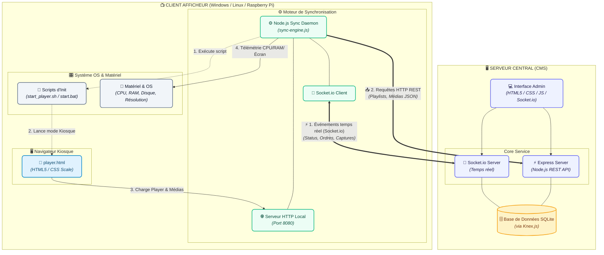

# Diagramme d'Architecture OmniSign

```mermaid
flowchart TD
    %% SUBGRAPH SERVEUR CENTRAL
    subgraph CMS ["🖥️ SERVEUR CENTRAL (CMS)"]
        direction TB
        Admin["💻 Interface Admin<br/><i>(HTML5 / CSS / JS / Socket.io)</i>"]
        
        subgraph CMS_Core ["Core Service"]
            Express["⚡ Express Server<br/><i>(Node.js REST API)</i>"]
            SocketServer["🔄 Socket.io Server<br/><i>(Temps réel)</i>"]
        end
        
        DB[("🗄️ Base de Données SQLite<br/><i>(via Knex.js)</i>")]

        Admin --> Express
        Admin --> SocketServer
        Express --- DB
        SocketServer --- DB
    end

    %% SUBGRAPH CLIENT AFFICHEUR
    subgraph CLIENT ["📺 CLIENT AFFICHEUR (Windows / Linux / Raspberry Pi)"]
        direction TB
        
        subgraph SYNC ["⚙️ Moteur de Synchronisation"]
            Engine["⚙️ Node.js Sync Daemon<br/><i>(sync-engine.js)</i>"]
            SocketClient["🔄 Socket.io Client"]
            LocalWeb["🌐 Serveur HTTP Local<br/><i>(Port 8080)</i>"]
            
            Engine --- SocketClient
            Engine --- LocalWeb
        end

        subgraph BROWSER ["🖥️ Navigateur Kiosque"]
            Player["🎨 player.html<br/><i>(HTML5 / CSS Scale)</i>"]
        end

        subgraph SYSTEM ["🎛️ Système OS & Matériel"]
            Exec["📜 Scripts d'Init<br/><i>(start_player.sh / start.bat)</i>"]
            HW["🔌 Matériel & OS<br/><i>(CPU, RAM, Disque, Résolution)</i>"]
        end

        Engine -.->|"1. Exécute script"| Exec
        Exec -.->|"2. Lance mode Kiosque"| Player
        Player -->|"3. Charge Player & Médias"| LocalWeb
        Engine -->|"4. Télémétrie CPU/RAM/Écran"| HW
    end

    %% COMMUNICATIONS RESEAU (INTER-SYSTEMES)
    SocketClient <==>|"⚡ 1. Événements temps réel (Socket.io)<br/><i>(Status, Ordres, Captures)</i>"| SocketServer
    Engine ===>|"📥 2. Requêtes HTTP REST<br/><i>(Playlists, Médias JSON)</i>"| Express

    %% STYLISATION (CLASSDEF)
    classDef serverStyle fill:#EEF2FF,stroke:#6366F1,stroke-width:2px,color:#1E1B4B,rx:8px,ry:8px;
    classDef clientStyle fill:#ECFDF5,stroke:#10B981,stroke-width:2px,color:#064E3B,rx:8px,ry:8px;
    classDef dbStyle fill:#FEF3C7,stroke:#F59E0B,stroke-width:2px,color:#78350F,rx:8px,ry:8px;
    classDef sysStyle fill:#F1F5F9,stroke:#64748B,stroke-width:2px,color:#0F172A,rx:8px,ry:8px;
    classDef browserStyle fill:#E0F2FE,stroke:#0284C7,stroke-width:2px,color:#0C4A6E,rx:8px,ry:8px;

    class Express,SocketServer,Admin serverStyle;
    class Engine,SocketClient,LocalWeb clientStyle;
    class DB dbStyle;
    class Exec,HW sysStyle;
    class Player browserStyle;
```