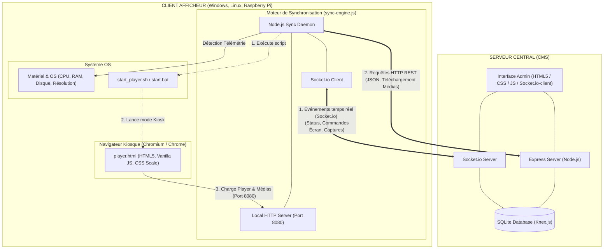

# OmniSign Technical Architecture / Architecture Technique

---

## 🌍 Language Selector / Choix de la langue

*   [🇬🇧 English Version](#english-technical-architecture)
*   [🇫🇷 Version en Français](#architecture-technique-omnisign-fr)

---

## English Technical Architecture

This document outlines the client-server relationships of the **OmniSign** digital signage solution, as well as the technologies utilized by each component.

---

### 1. Global Client-Server Diagram

The following diagram illustrates the network flows and technologies involved between the central server (CMS) and the client players (Windows / Linux / Raspberry Pi):

---

### 2. Table of Technologies Used

| Component / Layer | Technology / Tool | Role & Description |
| :--- | :--- | :--- |
| **Server - Backend Framework** | **Node.js & Express** | Handles REST APIs, media file distribution, and authentication. |
| **Server - Database** | **SQLite (via Knex.js)** | Local database storing configurations, playlists, and screen statuses. Knex.js handles querying and schema migrations. |
| **Server - Web Admin Panel** | **HTML5 / CSS / Vanilla JS** | Administration and monitoring dashboard (live vignettes, template editor). |
| **Network - Real-time** | **Socket.io & Socket.io-client** | Persistent bi-directional communication for remote display control, flash messages, and instant screen capturing. |
| **Client - Sync Daemon** | **Node.js Daemon (sync-engine.js)** | Autonomous background service running on the player. Fetches playlists, downloads media assets, and reports telemetry. |
| **Client - Local Web Server** | **Node.js HTTP Server (Port 8080)** | Mini local web server serving `player.html` and locally cached media assets to Chromium. Uses specific `Cache-Control` headers to prevent cache locks. |
| **Client - Visual Renderer** | **Chromium / Google Chrome** | Launched in full-screen Kiosk mode (`--kiosk`), executing `player.html`. |
| **Client - Display Engine** | **HTML5 / CSS3 / Vanilla JS** | Handles playback transitions, Canteen/Meeting/Weather templates rendering, and performs CSS-based auto-scaling via `transform: scale()` matching the design resolution (1920x1080). |
| **Client - Shell scripts** | **Bash / PowerShell** | System scripts (`start_player.sh`, `setup_pi.sh`, Windows PowerShell scripts) to hide the cursor (`unclutter`), configure display waking (DPMS/wlopm), and fetch physical display resolutions. |

---

### 3. Detailed Communication Flows

#### A. Player Startup (Boot & Init)
1. The startup script (`start_player.sh` or `.bat`) cleans screen lock files and removes Chromium cache.
2. The script launches `sync-engine.js` in the background via Node.js.
3. The local HTTP server starts listening on `http://127.0.0.1:8080`.
4. Chromium starts in kiosk mode and loads the local page `http://127.0.0.1:8080/player`.

#### B. Sync Engine Lifecycle (sync-engine.js)
- **Telemetry Reporting**: Detects system information (CPU temperature, disk space, RAM usage, MAC/IP address, and physical display resolution) and pushes them to the CMS via Socket.io.
- **Playlist Verification**: Periodically polls the CMS (REST HTTP GET requests) to retrieve updated playlists. Any new media assets are downloaded and cached in the player's local storage.

#### C. Adaptive Graphic Rendering (player.html)
- **Automatic Scaling**: Upon loading, `player.html` calculates the screen ratio against the layout design dimensions (1920x1080). It applies CSS dynamic scaling via `transform: scale()` on the active slide to perfectly fit any resolution or ratio without stretching or loss of quality.

---
---

## Architecture Technique OmniSign (FR)

Ce document présente les relations client-serveur de la solution d'affichage dynamique **OmniSign**, ainsi que les technologies utilisées par chaque composant.

---

### 1. Schéma Global de la Relation Client-Serveur

Voici le diagramme représentant les flux réseaux et les technologies impliquées entre le serveur central (CMS) et les afficheurs clients (Windows / Linux / Raspberry Pi) :

---

### 2. Tableau des Technologies Utilisées

| Composant / Couche | Technologie / Outil | Rôle & Description |
| :--- | :--- | :--- |
| **Serveur - Framework Backend** | **Node.js & Express** | Gère les API REST, la distribution des fichiers médias, et l'authentification. |
| **Serveur - Base de données** | **SQLite (via Knex.js)** | Base de données locale pour la configuration, les playlists et l'état des écrans. Knex.js gère le requêtage et les migrations de schéma. |
| **Serveur - Interface Web Admin** | **HTML5 / CSS / Vanilla JS** | Interface d'administration et de supervision (vignettes, édition des templates). |
| **Réseau - Temps réel** | **Socket.io & Socket.io-client** | Communication bidirectionnelle permanente pour l'allumage des écrans, les alertes, et la demande instantanée de captures d'écran. |
| **Client - Daemon de synchronisation** | **Node.js Daemon (sync-engine.js)** | Service d'arrière-plan autonome qui tourne sur le client. Récupère la playlist, télécharge les médias et remonte la télémétrie. |
| **Client - Distribution locale** | **Node.js HTTP Server (Port 8080)** | Mini serveur web local qui sert `player.html` et les fichiers médias locaux à Chromium. Configuré avec des entêtes `Cache-Control` pour éviter les blocages de cache. |
| **Client - Rendu Visuel (Player)** | **Chromium / Google Chrome** | Lancé en mode Kiosque plein écran (`--kiosk`). Il exécute `player.html`. |
| **Client - Moteur d'affichage** | **HTML5 / CSS3 / Vanilla JS** | Gère les transitions, l'affichage météo/réunion/cantine, et effectue des zooms automatiques CSS via `transform: scale()` selon la résolution virtuelle de design (1920x1080). |
| **Client - Shell scripts** | **Bash / PowerShell** | Scripts système (`start_player.sh`, `setup_pi.sh`, scripts PowerShell Windows) pour masquer le curseur (`unclutter`), configure l'éveil écran (DPMS/wlopm) et récupérer la résolution d'écran physique. |

---

### 3. Flux de Communication Détaillé

#### A. Démarrage de l'afficheur (Boot & Init)
1. Le script système (`start_player.sh` ou `.bat`) nettoie les verrous de session et supprime le cache de Chromium.
2. Le script lance en arrière-plan `sync-engine.js` via Node.js.
3. Le serveur HTTP local se met en écoute sur `http://127.0.0.1:8080`.
4. Chromium démarre en mode kiosque et charge la page locale `http://127.0.0.1:8080/player`.

#### B. Cycle de Vie du Moteur de Synchro (sync-engine.js)
- **Télémétrie** : Détecte les données système (température CPU, espace disque, RAM, adresse MAC/IP et résolution d'écran actuelle) et les envoie via Socket.io au CMS.
- **Vérification de Playlist** : Interroge périodiquement le CMS (requêtes HTTP GET REST) pour obtenir la playlist à jour. S'il y a des nouveaux médias, ils sont téléchargés et stockés dans le stockage local de l'afficheur.

#### C. Rendu Graphique Adaptatif (player.html)
- **Mise à l'échelle automatique** : Au chargement, `player.html` calcule le ratio de l'écran par rapport à sa base de design virtuelle (ex: 1920x1080). Il applique une mise à l'échelle via `transform: scale()` sur la diapo active pour qu'elle s'ajuste parfaitement aux écrans de petite résolution ou de résolution non standard sans déformation ni perte de qualité.
