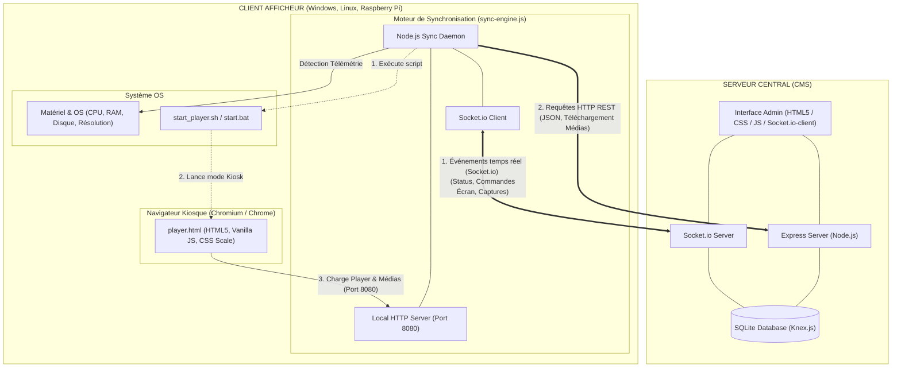

# Architecture Technique OmniSign

Ce document présente les relations client-serveur de la solution d'affichage dynamique **OmniSign**, ainsi que les technologies utilisées par chaque composant.

---

## 1. Schéma Global de la Relation Client-Serveur

Voici le diagramme représentant les flux réseaux et les technologies impliquées entre le serveur central (CMS) et les afficheurs clients (Windows / Linux / Raspberry Pi) :

---

## 2. Tableau des Technologies Utilisées

| Composant / Couche | Technologie / Outil | Rôle & Description |
| :--- | :--- | :--- |
| **Serveur - Framework Backend** | **Node.js & Express** | Gère les API REST, la distribution des fichiers médias, et l'authentification. |
| **Serveur - Base de données** | **SQLite (via Knex.js)** | Base de données locale pour la configuration, les playlists et l'état des écrans. Knex.js gère le requêtage et les migrations de schéma. |
| **Serveur - Interface Web Admin** | **HTML5 / CSS / Vanilla JS** | Interface d'administration et de supervision (vignettes, édition des templates). |
| **Réseau - Temps réel** | **Socket.io & Socket.io-client** | Communication bidirectionnelle permanente pour l'allumage des écrans, les alertes, et la demande instantanée de captures d'écran. |
| **Client - Daemon de synchronisation** | **Node.js Daemon (sync-engine.js)** | Service d'arrière-plan autonome qui tourne sur le client. Récupère la playlist, télécharge les médias et remonte la télémétrie. |
| **Client - Distribution locale** | **Node.js HTTP Server (Port 8080)** | Mini serveur web local qui sert `player.html` et les fichiers médias locaux à Chromium. Configuré avec des entêtes `Cache-Control` pour éviter les blocages de cache. |
| **Client - Rendu Visuel (Player)** | **Chromium / Google Chrome** | Lancé en mode Kiosque plein écran (`--kiosk`). Il exécute `player.html`. |
| **Client - Moteur d'affichage** | **HTML5 / CSS3 / Vanilla JS** | Gère les transitions, l'affichage météo/réunion/cantine, et effectue des zooms automatiques CSS via `transform: scale()` selon la résolution virtuelle de design (1920x1080). |
| **Client - Shell scripts** | **Bash / PowerShell** | Scripts système (`start_player.sh`, `setup_pi.sh`, scripts PowerShell Windows) pour masquer le curseur (`unclutter`), configurer l'éveil écran (DPMS/wlopm) et récupérer la résolution d'écran physique. |

---

## 3. Flux de Communication Détaillé

### A. Démarrage de l'afficheur (Boot & Init)
1. Le script système (`start_player.sh` ou `.bat`) nettoie les verrous de session et supprime le cache de Chromium.
2. Le script lance en arrière-plan `sync-engine.js` via Node.js.
3. Le serveur HTTP local se met en écoute sur `http://127.0.0.1:8080`.
4. Chromium démarre en mode kiosque et charge la page locale `http://127.0.0.1:8080/player`.

### B. Cycle de Vie du Moteur de Synchro (sync-engine.js)
- **Télémétrie** : Détecte les données système (température CPU, espace disque, RAM, adresse MAC/IP et résolution d'écran actuelle) et les envoie via Socket.io au CMS.
- **Vérification de Playlist** : Interroge périodiquement le CMS (requêtes HTTP GET REST) pour obtenir la playlist à jour. S'il y a des nouveaux médias, ils sont téléchargés et stockés dans le stockage local de l'afficheur.

### C. Rendu Graphique Adaptatif (player.html)
- **Mise à l'échelle automatique** : Au chargement, `player.html` calcule le ratio de l'écran par rapport à sa base de design virtuelle (ex: 1920x1080). Il applique une mise à l'échelle via `transform: scale()` sur la diapo active pour qu'elle s'ajuste parfaitement aux écrans de petite résolution ou de résolution non standard sans déformation ni perte de qualité.
